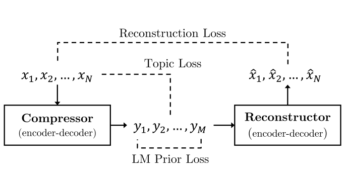
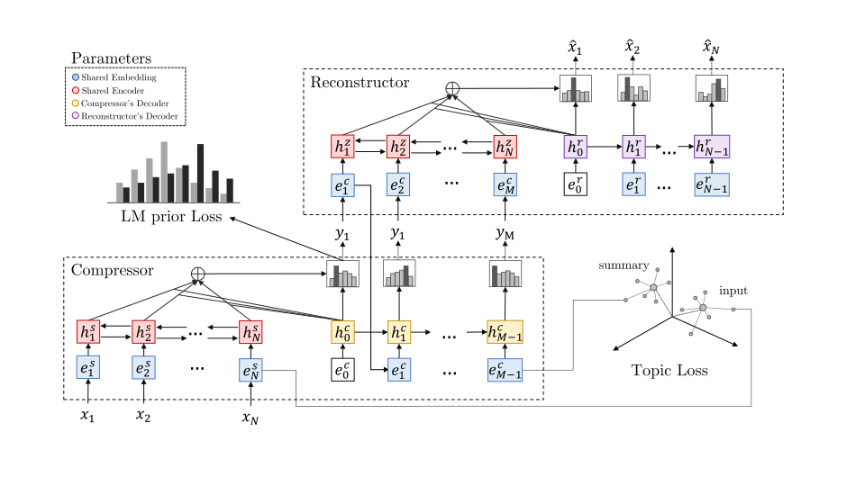

This repository contains source code for the ΝΑACL 2019 paper 
"SEQ^3: Differentiable Sequence-to-Sequence-to-Sequence Autoencoder 
for Unsupervised Abstractive Sentence Compression" 
([Paper](https://arxiv.org/abs/1904.03651)).

<p align="center">
  
</p>

# Introduction
The paper presents a sequence-to-sequence-to-sequence (SEQ<sup>3</sup>)
autoencoder consisting of two chained encoder-decoder pairs, 
with words used as a sequence of discrete latent variables. 
We employ continuous approximations to sampling from categorical distributions, 
in order to generate the latent sequence of words. This enables gradient-based
optimization.

We apply the proposed model to unsupervised abstractive sentence compression, 
where the first and last sequences are the input and reconstructed sentences, 
respectively, while the middle sequence is the compressed sentence. 
Constraining the length of the latent word sequences forces the model 
to distill important information from the input. 

### Architecture
<p align="center">
  
</p>


##### Reference
```
@inproceedings{baziotis2019naacl,
    title = {\textsc{SEQ}\textsuperscript{3}: Differentiable Sequence-to-Sequence-to-Sequence Autoencoder for Unsupervised Abstractive Sentence Compression},
    author = {Christos Baziotis and Ion Androutsopoulos and Ioannis Konstas and Alexandros Potamianos},
    booktitle = {Proceedings of the Conference of the North American Chapter of the Association for Computational Linguistics: Human Language Technologies (NAACL:HLT)},
    address = {Minneapolis, USA},
    month = {June},
    url = {https://arxiv.org/abs/1904.03651},
    year = {2019}
}
```

# Prerequisites

### Dependencies
 - PyTorch version >= 1.0.0
 - Python version >= 3.6
 
 
### Install Requirements

**Create Environment (Optional)**: Ideally, you should create an environment 
for the project.

```
conda create -n seq3 python=3
conda activate seq3
```

Install PyTorch `1.0` with the desired Cuda version if you want to use the GPU
and then the rest of the requirements:

```
pip install -r requirements.txt
```


### Download Data
To train the model you need to download the training data and 
the pretrained word embeddings.

**Dataset**: In our experiments we used the Gigaword dataset, 
which can be downloaded from: https://github.com/harvardnlp/sent-summary
Extract the data in `datasets/gigaword/` and organize the files as:
```
datasets
└── gigaword
      └── dev/
      └── test1951/
      └── train.article.txt
      └── train.title.txt
      └── valid.article.filter.txt
      └── valid.title.filter.txt
```

Included in `datasets/gigaword/dev/` you will find a small subset of the source 
(the target summaries are never used) training data, i.e., the articles,
which were used for prototyping, as well as a dev set with 
4K parallel sentences for evaluation.


You can also use your own data, as long as the source and target data 
are text files with one sentence per line.

**Embeddings**: In our experiments we used the 
"Wikipedia 2014 + Gigaword 5" (6B) Glove embeddings: 
http://nlp.stanford.edu/data/wordvecs/glove.6B.zip
Put the embedding files in the `embeddings/` directory.

# Training
In order to train a model, either the LM or SEQ<sup>3</sup>, you need 
to run the corresponding python script and pass as an argument a yaml 
model config. The yaml config specifies everything regarding the 
experiment to be executed. Therefore, if you want to make any changes
to a model, change or create a new yaml config. The model config files
are under the `model_configs/` directory. Use the provided configs as
reference. Each parameter is documented in comments, 
although most of them are self-explanatory.

### Train the Language Model prior
In our experiments we trained the LM on the *source* (only) sentences 
of the Gigaword dataset.
```
python models/sent_lm.py --config model_configs/camera/lm_prior.yaml 
```
After the training ends, the checkpoint with the best validation loss 
will be saved under the directory `checkpoints/`.


### Train SEQ<sup>3</sup>
Training the LM prior is a prerequisite for training SEQ<sup>3</sup>. 
While you will still be able to train the model without it, 
the LM prior loss will be disabled.

```
python models/seq3.py --config model_configs/camera/seq3.full.yaml 
```

**Prototyping**: You can experiment with SEQ<sup>3</sup> without downloading
the full training data, by training with the configs 
`model_configs/lm.yaml` and `model_configs/seq3.yaml`, respectively,
which use the small subset of the training data.


### Troubleshooting

 - If you get the error `ModuleNotFoundError: No module named 'X'`, 
 then add the directory `X` to your PYTHONPATH in your `~/.bashrc`, or simply:

    ```
    export PYTHONPATH='.'
    ```